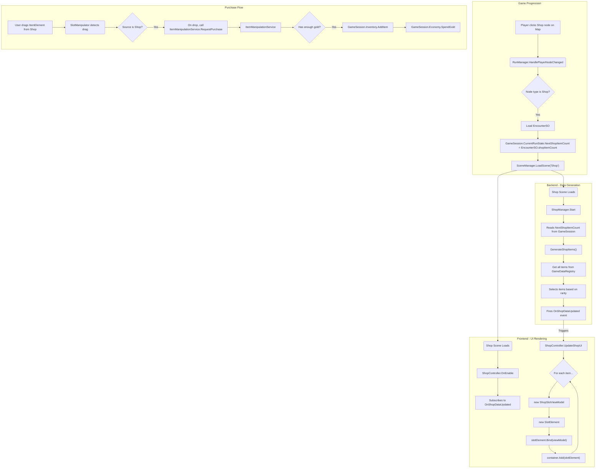

Battle screen should use different player panel ui to highlight the ships and equipment.

```mermaid width="1200" height="800"
graph TD
    subgraph Game Progression
        A["Player clicks Shop node on Map"] --> B("RunManager.HandlePlayerNodeChanged");
        B --> C{"Node type is Shop?"};
        C -- Yes --> D["Load EncounterSO"];
        D --> E["GameSession.CurrentRunState.NextShopItemCount = EncounterSO.shopItemCount"];
        E --> F["SceneManager.LoadScene('Shop')"];
    end

    subgraph "Backend - Data Generation"
        G("Shop Scene Loads") --> H["ShopManager.Start"];
        H --> I["Reads NextShopItemCount from GameSession"];
        I --> J["GenerateShopItems()"];
        J --> K["Get all items from GameDataRegistry"];
        K --> L["Selects items based on rarity"];
        L --> M["Fires OnShopDataUpdated event"];
    end

    subgraph "Frontend - UI Rendering"
        N("Shop Scene Loads") --> O["ShopController.OnEnable"];
        O --> P["Subscribes to OnShopDataUpdated"];
        M -- Triggers --> Q["ShopController.UpdateShopUI"];
        Q --> R{"For each item..."};
        R --> S["new ShopSlotViewModel"];
        S --> T["new SlotElement"];
        T --> U["slotElement.Bind(viewModel)"];
        U --> V["container.Add(slotElement)"];
        V --> R;
    end

    subgraph "Purchase Flow"
        W["User drags ItemElement from Shop"] --> X("SlotManipulator detects drag");
        X --> Y{"Source is Shop?"};
        Y -- Yes --> Z["On drop, call ItemManipulationService.RequestPurchase"];
        Z --> AA["ItemManipulationService"];
        AA --> BB{"Has enough gold?"};
        BB -- Yes --> CC["GameSession.Inventory.AddItem"];
        CC --> DD["GameSession.Economy.SpendGold"];
    end

    F --> G;
    F --> N;
```