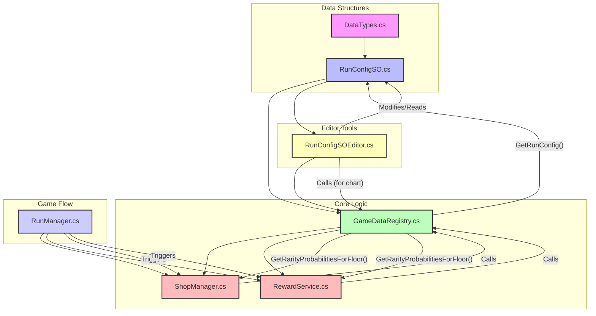

# Rarity System Redesign Plan

## Overview
This document outlines the plan to refactor the game's item rarity weighting system from a per-rarity start/end floor interpolation to a more flexible milestone/keyframe based system. It also includes the integration of an `EliteModifier` for Elite encounters.

## Symbol Map

### `DataTypes.cs`
- `public enum Rarity { Bronze, Silver, Gold, Diamond }`
- `[Serializable] public class RarityProbability { public Rarity rarity; public int weight; public int floorAvailable; public int floorUnavailable = int.MaxValue; }` (Will be removed/replaced)
- `[Serializable] public class RarityMilestone { public int floor; public List<RarityWeight> weights; }` (NEW)
- `[Serializable] public class RarityWeight { public Rarity rarity; public int weight; }` (NEW - simpler than RarityProbability for milestones)

### `RunConfigSO.cs`
- `public List<RarityProbability> startRarityProbabilities;` (Will be removed)
- `public List<RarityProbability> endRarityProbabilities;` (Will be removed)
- `public AnimationCurve rarityInterpolationCurve;` (Will be removed, as interpolation is now linear between milestones)
- `public List<RarityMilestone> rarityMilestones;` (NEW)
- `public int eliteModifier;` (NEW)

### `GameDataRegistry.cs`
- `public static RunConfigSO GetRunConfig();`
- `public static List<RarityProbability> GetRarityProbabilitiesForFloor(int floorIndex, int mapLength);` (Will be heavily modified to `GetRarityProbabilitiesForFloor(int floorIndex, int mapLength, bool isElite)`)

### `RunConfigSOEditor.cs`
- `private SerializedProperty _startRarityProbabilities;` (Will be removed)
- `private SerializedProperty _endRarityProbabilities;` (Will be removed)
- `private SerializedProperty _rarityInterpolationCurve;` (Will be removed)
- `private SerializedProperty _rarityMilestones;` (NEW)
- `private SerializedProperty _eliteModifier;` (NEW)
- `private void OnEnable();` (Will be modified)
- `public override void OnInspectorGUI();` (Will be modified)
- `private void DrawCombinedRarityProbabilitiesTable(SerializedProperty startList, SerializedProperty endList);` (Will be removed/replaced by `DrawRarityMilestoneTable`)
- `private void InitializeRarityList(SerializedProperty listProperty);` (Will be removed/modified for new milestone structure)
- `private SerializedProperty FindOrCreateRarityEntry(SerializedProperty listProperty, Rarity rarity);` (Will be removed/modified for new milestone structure)
- `private void DrawRarityInterpolationChart();` (Will be heavily modified to reflect milestone interpolation)
- `private Color GetRarityColor(Rarity rarity);` (Will remain the same)

### `ShopManager.cs`
- `private void GenerateShopItems();` (Calls `GameDataRegistry.GetRarityProbabilitiesForFloor`)
- `private Rarity GetRandomRarity(List<RarityProbability> probabilities);` (Uses the output of `GetRarityProbabilitiesForFloor`)
- `private void GenerateShopShip();` (Calls `GameDataRegistry.GetRarityProbabilitiesForFloor`)

### `RewardService.cs`
- `public static List<ItemSO> GenerateBattleRewards(int floorIndex, int mapLength);` (Calls `GameDataRegistry.GetRarityProbabilitiesForFloor`)

### `RunManager.cs`
- `private void LoadEncounter(EncounterType encounterType, int floorIndex);` (Will need to pass `isElite` to `GameDataRegistry` when calling for rewards/shop generation)

## Dependency/Call Graph



## Execution Steps

1.  **Define New Data Structures (`DataTypes.cs`)**
    *   Remove `RarityProbability` class.
    *   Add `RarityMilestone` class:
        ```csharp
        [Serializable]
        public class RarityMilestone
        {
            public int floor;
            public List<RarityWeight> weights;
        }
        ```
    *   Add `RarityWeight` class:
        ```csharp
        [Serializable]
        public class RarityWeight
        {
            public Rarity rarity;
            public int weight;
        }
        ```

2.  **Update `RunConfigSO.cs`**
    *   Remove `startRarityProbabilities`, `endRarityProbabilities`, `rarityInterpolationCurve`.
    *   Add `public List<RarityMilestone> rarityMilestones;`.
    *   Add `public int eliteModifier;`.

3.  **Refactor `GameDataRegistry.cs`**
    *   Modify `GetRarityProbabilitiesForFloor(int floorIndex, int mapLength)` signature to `GetRarityProbabilitiesForFloor(int floorIndex, int mapLength, bool isElite)`.
    *   Implement the new milestone-based interpolation logic:
        *   Find the correct milestone pair (`Fk`, `Fk+1`) for the given `floorIndex` (or `f_eff` if `isElite`).
        *   Handle clamping for floors outside the milestone range.
        *   Interpolate weights for each rarity.
        *   Normalize interpolated weights to probabilities.
        *   Return `List<RarityProbability>` (re-using the existing `RarityProbability` class for the *output* of this method, but its internal structure will be simpler, just `rarity` and `weight`).

4.  **Update `RunConfigSOEditor.cs`**
    *   Update `OnEnable` to find `_rarityMilestones` and `_eliteModifier` properties. Remove old rarity properties.
    *   Redesign `OnInspectorGUI` to draw `_eliteModifier` and call a new method for the milestone table.
    *   Create `private void DrawRarityMilestoneTable(SerializedProperty rarityMilestonesProp)`:
        *   Allow adding/removing milestones.
        *   For each milestone, allow setting the floor and a table of `RarityWeight`s.
        *   Include total weight display for each milestone.
    *   Modify `DrawRarityInterpolationChart()`:
        *   Use the new `rarityMilestones` data.
        *   Implement the milestone-based interpolation for visualization.
        *   Show the effect of `eliteModifier` on the chart.

5.  **Update Call Sites for `GameDataRegistry.GetRarityProbabilitiesForFloor`**
    *   **`ShopManager.cs`**:
        *   Update calls in `GenerateShopItems` and `GenerateShopShip` to pass `false` for `isElite`.
        *   Remove the upgrade edge case comment (as the new system might change how this is handled, or it can be re-added later if still relevant).
    *   **`RewardService.cs`**:
        *   Update calls in `GenerateBattleRewards` to pass `isElite` based on the encounter type.
    *   **`RunManager.cs`**:
        *   Ensure `EncounterType` is used to determine the `isElite` parameter when calling `GameDataRegistry.GetRarityProbabilitiesForFloor` for shop/reward generation.

6.  **Clean Up Old Code**
    *   Remove any unused `RarityProbability` related code from `RunConfigSOEditor.cs` (e.g., `DrawCombinedRarityProbabilitiesTable`, `InitializeRarityList`, `FindOrCreateRarityEntry`).

## Verification

*   **Unity Editor:** Verify `RunConfigSO` asset displays correctly with the new milestone table and `EliteModifier`.
*   **Rarity Chart:** Ensure the chart accurately reflects the milestone interpolation and the `EliteModifier`'s effect.
*   **Play Mode:** Test item/ship generation in shops and battle rewards across various floors, including Elite encounters, to confirm rarity distribution is as expected.
