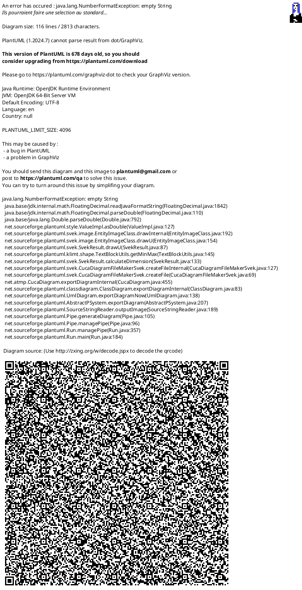

## Overview

The Item Manipulation Service (`ItemManipulationService.cs`) is a central singleton responsible for handling all item-related operations within the game. It acts as a crucial intermediary, decoupling UI interactions from direct modifications to the core game state. This service ensures that item swaps, purchases, and other manipulations are performed consistently and adhere to game rules.

## Design

The service is designed as a singleton to provide a single, authoritative point of control for item operations.

*   **Singleton Pattern:** Implemented as a static singleton (`ItemManipulationService.Instance`) to ensure a single instance manages all item manipulations globally.
*   **Dependencies:** It is initialized with an `IGameSession` instance, through which it accesses core game components like `Economy`, `Inventory`, and `PlayerShip`.
*   **Interaction with `UIInteractionService`:** Before executing any item manipulation, the service consults `UIInteractionService.CanManipulateItem` to verify that the action is permissible given the current UI state (e.g., not in combat, debug console not open). This prevents unintended or disallowed actions.
*   **Decoupling:** The service operates by modifying the underlying game state (e.g., adding/removing items from inventory). It does not directly manipulate UI elements; instead, changes to the game state trigger UI updates through an event-driven architecture (e.g., `ItemManipulationEvents`).

## Implementation Details

### Core Components

*   **`ItemManipulationService` (`Assets/Scripts/Core/ItemManipulationService.cs`):**
    *   **`Initialize(IGameSession gameSession)`:** Sets up the service's dependency on the `IGameSession` instance, providing access to core game data and services.
    *   **`RequestSwap(SlotId fromSlot, SlotId toSlot)`:**
        *   Receives `SlotId` objects representing the source and destination slots.
        *   Performs a preliminary check using `UIInteractionService.CanManipulateItem` for both `fromSlot` and `toSlot` containers.
        *   Delegates the actual item movement logic to the `ExecuteSwap` private method.
    *   **`RequestPurchase(SlotId shopSlot, SlotId playerSlot)`:**
        *   Validates that the `shopSlot` originates from a `SlotContainerType.Shop`.
        *   Retrieves the `ItemSO` corresponding to the item being purchased from `ShopManager.Instance.GetShopItem(shopSlot.Index)`. This represents a direct coupling to the `ShopManager`.
        *   Verifies if the player possesses sufficient gold using `_gameSession.Economy.TrySpendGold(itemToPurchase.Cost)`. If the purchase fails due to insufficient funds, gold is not spent, and a message is displayed via `ShopManager.Instance.DisplayMessage`.
        *   Determines the `targetFinalSlot` for the purchased item. It prioritizes finding the first available empty slot in the player's inventory, then in their equipment. If no suitable slot is found, the gold is refunded, and an "Inventory full!" message is displayed.
        *   Adds the newly purchased `ItemInstance` to the `targetFinalSlot` within either `_gameSession.Inventory` or `_gameSession.PlayerShip`.
        *   Upon successful purchase, the item is removed from the shop's available items via `ShopManager.Instance.RemoveShopItem(shopSlot.Index)`.
    *   **`ExecuteSwap(SlotId slotA, SlotId slotB)` (Private Method):**
        *   Manages the low-level logic for swapping `ItemInstance` objects between any two specified slots. This involves retrieving items from their current locations, removing them, and then placing them into their new target slots.
*   **`SlotId` (`PirateRoguelike.Services.SlotId`):**
    *   A lightweight `struct` used throughout the item manipulation system to uniquely identify an item slot. It combines an integer `Index` (representing the slot's position within its container) and a `SlotContainerType` (specifying the type of container, e.g., Inventory, Equipment, Shop).
*   **`SlotContainerType` (`PirateRoguelike.Services.SlotContainerType`):**
    *   An `enum` that categorizes different types of item containers within the game, such as `Inventory`, `Equipment`, `Shop`, and `Crafting`. This allows the `ItemManipulationService` to apply context-specific rules and logic.

## Related Documents

*   [UI Systems Overview]()
*   [Core Systems Overview]()
*   [Shop System Overview]()

## Process Flowchart

This diagram outlines the typical process flows for item manipulation requests handled by the `ItemManipulationService`.

