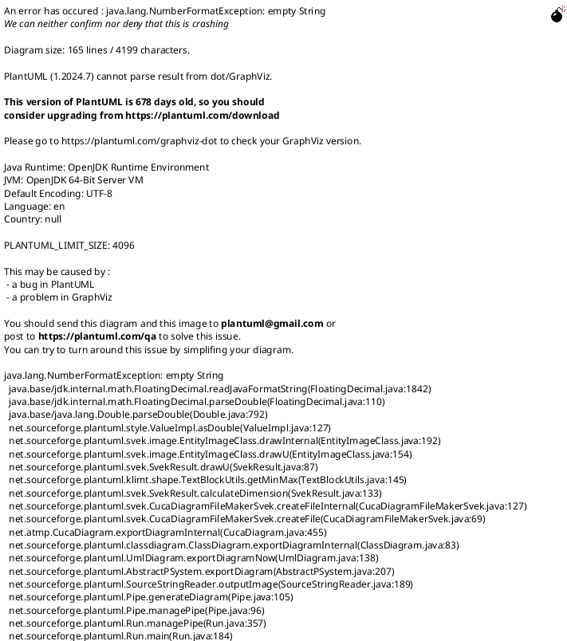

## Overview

The Item Manipulation Service (`ItemManipulationService.cs`) is a central singleton responsible for handling all item-related operations within the game. It acts as a crucial intermediary, decoupling UI interactions from direct modifications to the core game state. This service ensures that item swaps, purchases, and other manipulations are performed consistently and adhere to game rules.

## Design

The service is designed as a singleton to provide a single, authoritative point of control for item operations. Its methods are now primarily invoked by command objects (e.g., `PurchaseItemCommand`, `SwapItemCommand`) after those commands have performed necessary validation.

*   **Singleton Pattern:** Implemented as a static singleton (`ItemManipulationService.Instance`) to ensure a single instance manages all item manipulations globally.
*   **Dependencies:** It is initialized with an `IGameSession` instance, through which it accesses core game components like `Economy`, `Inventory`, and `PlayerShip`.
*   **Decoupling:** The service operates by modifying the underlying game state (e.g., adding/removing items from inventory). It does not directly manipulate UI elements; instead, changes to the game state trigger UI updates through an event-driven architecture (e.g., `ItemManipulationEvents`). It also dispatches `OnRewardItemClaimed` when a reward item is successfully claimed. Validation logic previously residing here has been moved to the command objects that invoke this service.

## Implementation Details

### Core Components

*   **`ItemManipulationService` (`Assets/Scripts/Core/ItemManipulationService.cs`):**
    *   **`Initialize(IGameSession gameSession)`:** Sets up the service's dependency on the `IGameSession` instance, providing access to core game data and services.
    *   **`PerformSwap(SlotId fromSlot, SlotId toSlot)`:**
        *   Receives `SlotId` objects representing the source and destination slots.
        *   Manages the low-level logic for swapping `ItemInstance` objects between any two specified slots. This involves retrieving items from their current locations, removing them, and then placing them into their new target slots.
        *   This method is now public and is called by `SwapItemCommand.Execute()`.
    *   **`PerformPurchase(ItemSO itemToPurchase, SlotId targetFinalSlot, SlotId shopSlot)`:**
        *   Receives the `ItemSO` to purchase, the final destination `SlotId`, and the source `shopSlot`.
        *   Adds the newly purchased `ItemInstance` to the `targetFinalSlot` within either `_gameSession.Inventory` or `_gameSession.PlayerShip`.
        *   Upon successful purchase, the item is removed from the shop's available items via `ShopManager.Instance.RemoveShopItem(shopSlot.Index)`.
        *   This method is called by `PurchaseItemCommand.Execute()` after all validation (gold, slot availability) has passed.
    *   **`PerformClaimReward(ItemSO itemToClaim, SlotId targetFinalSlot, SlotId sourceSlot)`:**
        *   Receives the `ItemSO` to claim, the final destination `SlotId`, and the source `sourceSlot`.
        *   Adds the `ItemInstance` to the `targetFinalSlot` within `_gameSession.Inventory` or `_gameSession.PlayerShip`.
        *   Upon successful claim, calls `RewardService.RemoveClaimedItem(itemToClaim)` to update the reward state by removing the specific `ItemSO` instance.
        *   This method is called by `ClaimRewardItemCommand.Execute()` after all validation (slot availability) has passed.
*   **`SlotId` (`PirateRoguelike.Services.SlotId`):**
    *   A lightweight `struct` used throughout the item manipulation system to uniquely identify an item slot. It combines an integer `Index` (representing the slot's position within its container) and a `SlotContainerType` (specifying the type of container, e.g., Inventory, Equipment, Shop).
*   **`SlotContainerType` (`PirateRoguelike.Services.SlotContainerType`):**
    *   An `enum` that categorizes different types of item containers within the game, such as `Inventory`, `Equipment`, `Shop`, and `Crafting`. This allows the `ItemManipulationService` to apply context-specific rules and logic.

## Related Documents

*   [UI Systems Overview]()
*   [Core Systems Overview]()
*   [Shop System Overview]()

## Process Flowchart

This diagram outlines the typical process flows for item manipulation requests handled by the `ItemManipulationService`.

