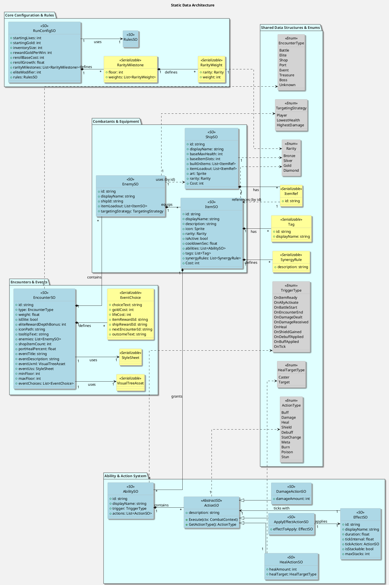

## 1. Static Game Data (ScriptableObjects & GameDataRegistry)

### Purpose
To define immutable, static game content such as items, ships, enemies, and game configuration. These are created and managed within the Unity Editor.

### Storage
`ScriptableObject` assets are stored under `Assets/Resources/GameData/` in various subdirectories (e.g., `Items`, `Ships`, `Encounters`, `Abilities`, `Actions`, `Effects`).

### Loading Mechanism (`GameDataRegistry.cs`)
*   **`GameDataRegistry` (`PirateRoguelike.Core.GameDataRegistry`):**
    *   File Path: Assets/Scripts/Core/GameDataRegistry.cs
    *   A static class responsible for loading all `ScriptableObject` data into memory at application startup.
*   The `Initialize()` method, marked with `[RuntimeInitializeOnLoadMethod(RuntimeInitializeLoadType.BeforeSceneLoad)]`, ensures that all data is loaded *before* any scene loads.
*   It uses `Resources.LoadAll<T>("GameData/...")` to load all assets of a specific type from the designated `Resources` folder paths.
*   Loaded assets are stored in `Dictionary<string, T>` for quick lookup by their `id` (e.g., `_items`, `_ships`, `_encounters`).
*   `RunConfigSO` is loaded directly using `Resources.Load<RunConfigSO>("GameData/RunConfiguration").

### Access
Provides static `Get` methods (e.g., `GetItem(string id)`, `GetShip(string id)`, `GetEncounter(string id)`, `GetRunConfig()`) to retrieve loaded data.

### Dynamic Rarity Calculation
`GameDataRegistry` also contains logic (`GetRarityProbabilitiesForFloor`) to calculate item rarity probabilities based on `RunConfigSO`'s `rarityMilestones`, interpolating between milestones based on the current floor index.

### Key ScriptableObjects

This section details the primary ScriptableObjects used to define static game data.

*   **`AbilitySO` (`Assets/Scripts/Data/Abilities/AbilitySO.cs`):**
    *   **Purpose:** Defines a single ability that can be triggered by various combat events.
    *   **Create Asset Menu:** `Pirate/Abilities/Ability`
    *   **Key Fields:**
        *   `id` (string): Unique identifier for the ability.
        *   `displayName` (string): Display name for the ability.
        *   `trigger` (`TriggerType`): The event that triggers this ability (e.g., `OnBattleStart`, `OnDamageDealt`).
        *   `actions` (List of `ActionSO`): A list of actions to be executed when this ability is triggered.
    *   **Relationships:** Contains a list of `ActionSO`s. Referenced by `ItemSO`.

*   **`ActionSO` (`Assets/Scripts/Data/Actions/ActionSO.cs`):**
    *   **Purpose:** Abstract base class for all concrete actions that an `AbilitySO` can execute. Concrete implementations define specific behaviors like dealing damage, healing, or applying effects.
    *   **Key Fields:**
        *   `description` (string): A text description of the action.
    *   **Methods:**
        *   `Execute(CombatContext ctx)`: Abstract method to be implemented by subclasses, containing the action's logic.
        *   `GetActionType()`: Abstract method to return the specific `ActionType` of the action.
    *   **Relationships:** Parent class for `ApplyEffectActionSO`, `DamageActionSO`, `HealActionSO`.

*   **`ApplyEffectActionSO` (`Assets/Scripts/Data/Actions/ApplyEffectActionSO.cs`):**
    *   **Purpose:** A concrete `ActionSO` that applies a specified `EffectSO` to the target of the action.
    *   **Create Asset Menu:** `Pirate/Actions/Apply Effect Action`
    *   **Key Fields:**
        *   `effectToApply` (`EffectSO`): The effect to be applied when this action executes.
    *   **Relationships:** References an `EffectSO`.

*   **`DamageActionSO` (`Assets/Scripts/Data/Actions/DamageActionSO.cs`):**
    *   **Purpose:** A concrete `ActionSO` that deals a specified amount of damage to the target of the action.
    *   **Create Asset Menu:** `Pirate/Actions/Damage Action`
    *   **Key Fields:**
        *   `damageAmount` (int): The amount of damage to deal.

*   **`HealActionSO` (`Assets/Scripts/Data/Actions/HealActionSO.cs`):**
    *   **Purpose:** A concrete `ActionSO` that heals the caster of the action for a specified amount.
    *   **Create Asset Menu:** `Pirate/Actions/Heal Action`
    *   **Key Fields:**
        *   `healAmount` (int): The amount of health to restore.

*   **`EffectSO` (`Assets/Scripts/Data/Effects/EffectSO.cs`):**
    *   **Purpose:** Defines a persistent combat effect (e.g., buff, debuff, damage over time) that can be applied to a ship.
    *   **Create Asset Menu:** `Pirate/Effects/Effect`
    *   **Key Fields:**
        *   `id` (string): Unique identifier for the effect.
        *   `displayName` (string): Display name for the effect.
        *   `duration` (float): How long the effect lasts in seconds.
        *   `tickInterval` (float): How often the `tickAction` is performed (0 for no tick).
        *   `tickAction` (`ActionSO`): An optional action to perform on each tick of the effect.
        *   `isStackable` (bool): Whether multiple instances of this effect can stack.
        *   `maxStacks` (int): Maximum number of stacks if `isStackable` is true.
    *   **Relationships:** Contains an `ActionSO` for its tick effect. Referenced by `ApplyEffectActionSO`.

*   **`EncounterSO` (`Assets/Scripts/Data/EncounterSO.cs`):**
    *   **Purpose:** Defines the parameters for different types of encounters a player can face on the map (e.g., battle, shop, event, port).
    *   **Create Asset Menu:** `Pirate/Data/Encounter`
    *   **Key Fields:**
        *   `id` (string): Unique identifier for the encounter.
        *   `type` (`EncounterType`): The type of encounter (e.g., `Battle`, `Shop`, `Event`).
        *   `weight` (float): For weighted random selection of encounters.
        *   `isElite` (bool): Indicates if this is an elite encounter.
        *   `eliteRewardDepthBonus` (int): Bonus for reward generation in elite encounters.
        *   `iconPath` (string): Path to the icon sprite for the encounter.
        *   `tooltipText` (string): Text displayed when hovering over the encounter on the map.
        *   `enemies` (List of `EnemySO`): For battle encounters, a list of enemies to fight.
        *   `shopItemCount` (int): For shop encounters, the number of items available.
        *   `portHealPercent` (float): For port encounters, percentage of health healed.
        *   `eventTitle` (string): For event encounters, the title of the event.
        *   `eventDescription` (string): For event encounters, the description of the event.
        *   `eventUxml` (`VisualTreeAsset`): For event encounters, the UXML asset that defines the UI structure.
        *   `eventUss` (`StyleSheet`): For event encounters, the USS asset for styling the UI.
        *   `minFloor`, `maxFloor` (int): Floor range for event encounters.
        *   `eventChoices` (List of `EventChoice`): For event encounters, a list of choices the player can make.
    *   **Relationships:** Contains lists of `EnemySO`s and `EventChoice`s. References `VisualTreeAsset` and `StyleSheet` for event UI.

*   **`EnemySO` (`Assets/Scripts/Data/EnemySO.cs`):**
    *   **Purpose:** Defines a specific enemy, including its base ship type and initial equipped items.
    *   **Create Asset Menu:** `Pirate/Data/Enemy`
    *   **Key Fields:**
        *   `id` (string): Unique identifier for the enemy.
        *   `displayName` (string): Display name for the enemy.
        *   `shipId` (string): The ID of the `ShipSO` this enemy uses as its base.
        *   `itemLoadout` (List of `ItemSO`): Items the enemy starts with.
        *   `targetingStrategy` (`TargetingStrategy`): AI strategy for targeting in combat.
    *   **Relationships:** References a `ShipSO` (by ID) and contains a list of `ItemSO`s.

*   **`ItemSO` (`Assets/Scripts/Data/ItemSO.cs`):**
    *   **Purpose:** Defines a static item, including its visual representation, stats, abilities, and shop cost.
    *   **Create Asset Menu:** `Pirate/Data/Item`
    *   **Key Fields:**
        *   `id` (string): Unique identifier for the item.
        *   `displayName` (string): Display name for the item.
        *   `description` (string): Detailed description of the item.
        *   `icon` (Sprite): Visual icon for the item.
        *   `rarity` (`Rarity`): Rarity tier of the item.
        *   `isActive` (bool): Whether the item has an active ability (e.g., requires cooldown).
        *   `cooldownSec` (float): Cooldown duration in seconds if `isActive` is true.
        *   `abilities` (List of `AbilitySO`): Abilities granted by this item.
        *   `tags` (List of `Tag`): Categorization tags for the item.
        *   `synergyRules` (List of `SynergyRule`): Rules for item synergies.
        *   `Cost` (int, property): Calculated shop cost based on rarity.
    *   **Relationships:** Contains lists of `AbilitySO`s, `Tag`s, and `SynergyRule`s. Referenced by `EnemySO`.

*   **`RunConfigSO` (`Assets/Scripts/Data/RunConfigSO.cs`):**
    *   **Purpose:** Defines global configuration settings for a game run, such as starting resources and reward generation rules.
    *   **Create Asset Menu:** `Data/RunConfigSO`
    *   **Key Fields:**
        *   `startingLives` (int): Player's starting lives.
        *   `startingGold` (int): Player's starting gold.
        *   `inventorySize` (int): Size of the player's inventory.
        *   `rewardGoldPerWin` (int): Gold awarded after each battle win.
        *   `rerollBaseCost` (int): Base cost for rerolling shop items.
        *   `rerollGrowth` (float): Growth factor for reroll cost.
        *   `rarityMilestones` (List of `RarityMilestone`): Defines rarity probabilities per floor.
        *   `eliteModifier` (int): Modifier for elite encounter rewards.
        *   `rules` (`RulesSO`): Map generation rules.
    *   **Relationships:** Contains a list of `RarityMilestone`s and references `RulesSO`.

*   **`ShipSO` (`Assets/Scripts/Data/ShipSO.cs`):**
    *   **Purpose:** Defines a static ship type, including its base stats, visual art, and built-in items.
    *   **Create Asset Menu:** `Data/ShipSO`
    *   **Key Fields:**
        *   `id` (string): Unique identifier for the ship.
        *   `displayName` (string): Display name for the ship.
        *   `baseMaxHealth` (int): Base maximum health of the ship.
        *   `baseItemSlots` (int): Number of item slots the ship has.
        *   `builtInItems` (List of `ItemRef`): Items the ship starts with (references by ID).
        *   `itemLoadout` (List of `ItemRef`): Additional items for specific loadouts (references by ID).
        *   `art` (Sprite): Visual sprite for the ship.
        *   `rarity` (`Rarity`): Rarity tier of the ship.
        *   `Cost` (int): Cost of the ship (e.g., in shop).
    *   **Relationships:** Contains lists of `ItemRef`s. Referenced by `EnemySO` (by ID).

### Data Structure Relationships (PlantUML Class Diagram)

This diagram illustrates the relationships between the various ScriptableObjects and related data structures.

## 2. Runtime Data (Item Instances & Runtime Objects)

### Problem Addressed
`ScriptableObject`s are static. To handle dynamic changes to item properties (e.g., temporary buffs, cooldowns, stun durations) and to display real-time values in UI, a runtime layer is necessary.

### Core Components (detailed in [Runtime Data Systems]()):
*   **`ItemInstance` (`PirateRoguelike.Data.ItemInstance`):**
    *   File Path: Assets/Scripts/Combat/ItemInstance.cs
    *   The primary runtime object representing a unique instance of an item. It holds a reference to its `ItemSO` blueprint and mutable fields like `CooldownRemaining` and `StunDuration`. Crucially, it contains a `RuntimeItem`.
*   **`RuntimeItem` (`PirateRoguelike.Runtime.RuntimeItem`):**
    *   File Path: Assets/Scripts/Runtime/RuntimeItem.cs
    *   Represents the dynamic abilities and actions of an `ItemInstance`. It's created from an `ItemSO` and manages a collection of `RuntimeAbility` instances.
*   **`RuntimeAbility` (`PirateRoguelike.Runtime.RuntimeAbility`):**
    *   File Path: Assets/Scripts/Runtime/RuntimeAbility.cs
    *   Represents a unique instance of an ability, created from an `AbilitySO`, and manages a collection of `RuntimeAction` instances.
*   **`RuntimeAction` (`PirateRoguelike.Runtime.RuntimeAction`):**
    *   File Path: Assets/Scripts/Runtime/RuntimeAction.cs
    *   An abstract base class for all unique action instances (e.g., `RuntimeDamageAction`, `RuntimeHealAction`). These wrap their `ActionSO` blueprints and hold mutable, runtime-specific values (e.g., `CurrentDamageAmount`).

### How it Works
When an item is needed, an `ItemInstance` is created. This, in turn, recursively creates `RuntimeItem`, `RuntimeAbility`, and `RuntimeAction` objects. Dynamic modifications are applied to the mutable fields within these runtime objects.

### Benefits
Flexibility for dynamic modifications, accurate UI display, clear separation of static vs. runtime data, improved testability.

## 3. Save/Load System

### Purpose
To persist the game state between sessions.

### Architecture (detailed in [Save Load System]()):
*   **`SaveManager` (`Assets/Scripts/Saving/SaveManager.cs`):** A static class handling the physical file operations (serializing `RunState` to JSON and writing to `run.json`, and deserializing back).
*   **`GameSession` (`Assets/Scripts/Core/GameSession.cs`):** The central static class holding the live, in-memory game state. It orchestrates the saving process by populating a `RunState` object and the loading process by re-initializing the live state from a `RunState` object.
*   **`RunState` (defined in `GameSession.cs`):** A serializable class acting as the root data container for a save file, holding all data to be persisted.

### Serializable Data Objects
To work with Unity's `JsonUtility`, live game objects are converted to simple, serializable plain C# objects:
*   `SerializableShipState` (`Assets/Scripts/Saving/SerializableShipState.ShipState.cs`)
*   `SerializableItemInstance` (`Assets/Scripts/Saving/SerializableItemInstance.cs`)

### Saving Process
`GameSession.UpdateCurrentRunStateForSaving()` populates `GameSession.CurrentRunState` with data converted to serializable forms (e.g., `PlayerShip.ToSerializable()`, `Inventory.ToSerializable()`). This `RunState` is then passed to `SaveManager.SaveRun()`.

### Loading Process
`SaveManager.LoadRun()` deserializes `run.json` into a `RunState` object, which is then passed to `GameSession.LoadRun()` to rehydrate the live game state.

### Known Issue (Critical Gap)
The save system currently **does not persist changes made to mutable properties within `RuntimeAction` instances**. This means dynamic buffs or modifications to item behaviors are lost upon saving and loading. A proposed solution involves extending `SerializableItemInstance` to store these modified properties.

## 4. Summary of Data Flow

1.  **Startup:** `GameDataRegistry` loads all static `ScriptableObject` data from `Resources`.
2.  **Gameplay:** `ItemInstance` and its nested `Runtime` objects are created from `ItemSO` blueprints. Dynamic changes occur on these runtime objects. `ShipState` manages its own internal state and equipped `ItemInstance`s.
3.  **Saving:** Live game state (`GameSession`, `ShipState`, `Inventory`, `ItemInstance`s) is converted into serializable `RunState`, `SerializableShipState`, and `SerializableItemInstance` objects, then saved to JSON.
4.  **Loading:** Saved JSON is deserialized into `RunState`, then used to re-create live game objects (`GameSession`, `ShipState`, `ItemInstance`s) from their `ScriptableObject` definitions, applying any *persisted* runtime modifications.

This comprehensive data system allows for flexible game content definition, dynamic runtime behavior, and persistent game state, though the current save system has a critical limitation regarding runtime action state.